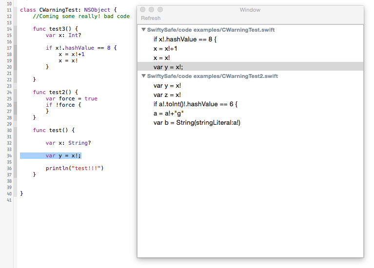
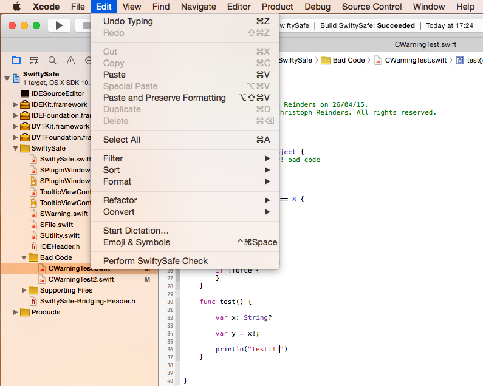

# SwiftySafe - Xcode Plug-in

As you might know, Swift is very strict about types and optional values. That is good because you can produce some really good code that handles all unecpected cases. The disadvantage is that you have to write a little bit more code. So one day you get lazy or get code from someone else which contains these harmless looking exclamation marks "!". But every of them might cause an unexpected crash. Because I noticed that it is really difficult to find all exclamation marks, I started developing this Xcode plug-in SwiftySafe which does the work for your and shows you which exclamation marks are potentially dangerous. 

## Install

Clone this respository, built the project, restart Xcode and that's it!

## Usage

You can open SwiftySafe via the menu: Edit->Perform SwiftySafe Check. It iterates through all Swift files from your project and find all exclamation marks that might cause a crash. You will see them in the appearing window and by clicking at one warning you jump direktly into the code.

## Possible Future Improvements

- Set a shortcut
- For now quotes are not further regarded but they can also contain exclamation marks e.g. "test \(a!)"
- Do check asynchronous and show progress
- Redo the check only if the project is different
- e.g. "(action:UIAlertAction!)" is recognized as a warning
